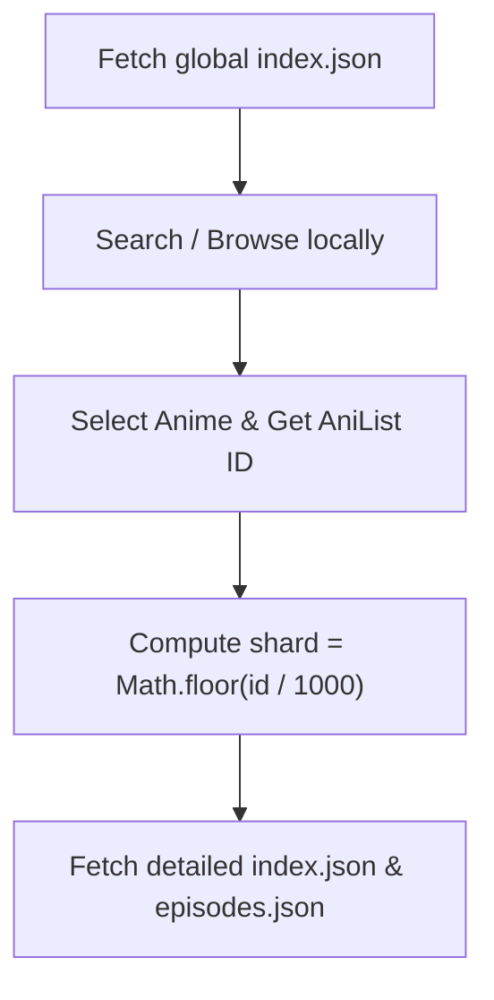

# Konoha

> **Public Anime Metadata Cache**

This repository is automatically maintained by the [AniSync](https://github.com/yourname/anisync) service. It contains high-fidelity anime metadata aggregated from AniList, TMDB, Jikan, and other sources.

## Data Access

All data is served via the **jsDelivr CDN** for maximum performance:

- **Global Index**: `https://cdn.jsdelivr.net/gh/AlokRepo/Konoha@main/data/index.json`
- **ID Mapping**: `https://cdn.jsdelivr.net/gh/AlokRepo/Konoha@main/data/id-map.json`
- **Search Index**: `https://cdn.jsdelivr.net/gh/AlokRepo/Konoha@main/data/search.json`
- **Genre Directory**: `https://cdn.jsdelivr.net/gh/AlokRepo/Konoha@main/data/genres.json`
- **Release Years**: `https://cdn.jsdelivr.net/gh/AlokRepo/Konoha@main/data/years.json`
- **Airing Now**: `https://cdn.jsdelivr.net/gh/AlokRepo/Konoha@main/data/airing.json`
- **Library Stats**: `https://cdn.jsdelivr.net/gh/AlokRepo/Konoha@main/data/stats.json`
- **Pipeline Status**: `https://cdn.jsdelivr.net/gh/AlokRepo/Konoha@main/data/sync-status.json`
- **Anime Details**: `https://cdn.jsdelivr.net/gh/AlokRepo/Konoha@main/data/anime/{shard}/{anilist_id}/index.json` (where `shard` is `Math.floor(anilist_id / 1000)`)
- **Episode Lists**: `https://cdn.jsdelivr.net/gh/AlokRepo/Konoha@main/data/anime/{shard}/{anilist_id}/episodes.json` (where `shard` is `Math.floor(anilist_id / 1000)`)
- **URL Slug Index**: `https://cdn.jsdelivr.net/gh/AlokRepo/Konoha@main/data/slugs/{shard}/{slug}/index.json` (where `shard` is `Math.floor(anilist_id / 1000)`)
- **AniList Mapping**: `https://cdn.jsdelivr.net/gh/AlokRepo/Konoha@main/data/mappings/anilist/{shard}/{anilist_id}.json` (where `shard` is `Math.floor(anilist_id / 1000)`)
- **MAL Mapping**: `https://cdn.jsdelivr.net/gh/AlokRepo/Konoha@main/data/mappings/mal/{shard}/{mal_id}.json` (where `shard` is `Math.floor(mal_id / 1000)`)
- **TMDB Mapping**: `https://cdn.jsdelivr.net/gh/AlokRepo/Konoha@main/data/mappings/tmdb/{type}/{shard}/{tmdb_id}.json` (where `shard` is `Math.floor(tmdb_id / 1000)`, type is "tv" or "movie")

## How to Retrieve and Navigate the Data

Here is a quick developer flow to fetch and use data from this repository inside your application:



### 1. Build a Search/Browse UI
Download the **Global Index** once when your application starts. Since it is compressed and lightweight (~4MB for 10k titles), you can perform instant client-side fuzzy searching, filtering (by genre, year, status), and pagination:
```javascript
const BASE_URL = "https://cdn.jsdelivr.net/gh/AlokRepo/Konoha@main/data";

// 1. Fetch catalog
const catalog = await fetch(`${BASE_URL}/index.json`).then(r => r.json());

// 2. Perform client-side filter
const trendingTV = catalog
  .filter(anime => anime.format === "TV" && anime.status === "RELEASING")
  .slice(0, 20);
```

### 2. Fetch Detailed Metadata
To load details for a specific anime, construct the sharded path using the AniList ID:
```javascript
function getAnimeDetailsUrl(anilistId) {
  const shard = Math.floor(anilistId / 1000);
  return `${BASE_URL}/anime/${shard}/${anilistId}/index.json`;
}

function getAnimeEpisodesUrl(anilistId) {
  const shard = Math.floor(anilistId / 1000);
  return `${BASE_URL}/anime/${shard}/${anilistId}/episodes.json`;
}

// Example usage: Fetching details for AniList ID 21 (One Piece)
const details = await fetch(getAnimeDetailsUrl(21)).then(r => r.json());
const episodes = await fetch(getAnimeEpisodesUrl(21)).then(r => r.json());
```

### 3. Cross-Reference Databases
If you need to fetch links, identifiers, or sync state with other databases (TMDB, MyAnimeList, Kitsu, AniDB, Simkl) without fetching the detailed index file first, read the **ID Mapping** file (`id-map.json`):
```javascript
const idMap = await fetch(`${BASE_URL}/id-map.json`).then(r => r.json());

// Get MAL / TMDB cross-references for AniList ID "21"
const mappings = idMap["21"]; 
console.log(mappings.mal);  // MyAnimeList ID
console.log(mappings.tmdb); // TMDB ID
```

---

## Purpose

The goal of Konoha is to provide a standardized, cross-source anime database that can be consumed by applications with zero server-side logic and sub-50ms latency.

---
Maintained by AniSync Pipeline.
